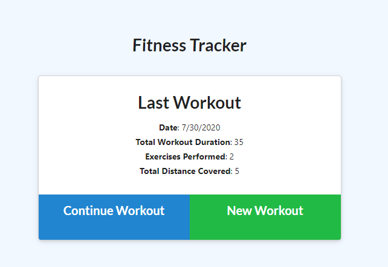
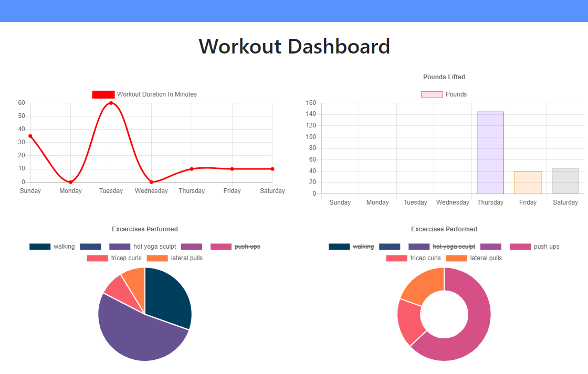

# 17_fitness-tracker

## Project Description
For this assigment, we are tasked to create a workout tracker to track the various cardio and resistance excercises.

### [Heroku Fitness Tracker LINK](https://limitless-fjord-68193.herokuapp.com/?id=5f23569efcab44001724b326)

## Experience
I had a lot of complications starting. I usually work in a practice file before moving items to github. As I moved things around, I would find that code would either break; or a function which did not work in my practice file would then work. It was really frustrating.

## Acceptance Criteria
Users should be albe to:
* Add exercises to a previous workout plan.
* Add new exercises to a new workout plan.
* View multiple the combined weight of multiple exercises on the stats/dashboard page.

